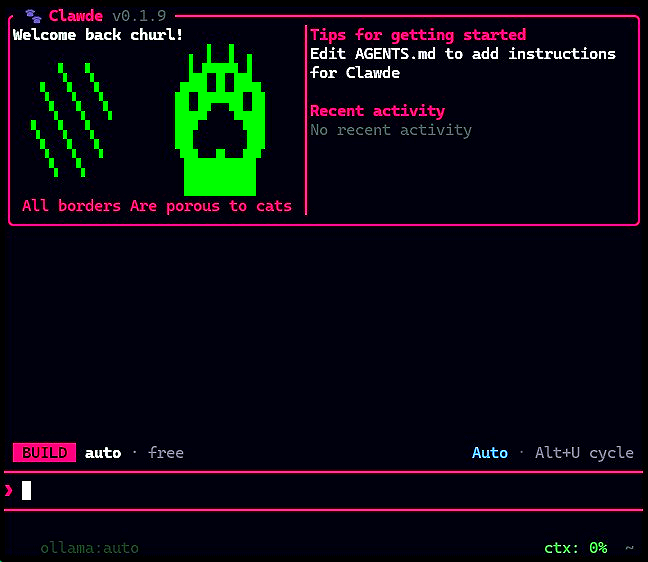

<div align="center">

<h1>CLAWDE</h1>
<h2><em>Your home for cat-related puns</em></h2>

<p>
    <a href="https://github.com/mattcmaddox/Clawde"></a>
    <a href="https://github.com/mattcmaddox/Clawde"></a>
    <a href="https://github.com/mattcmaddox/Clawde/blob/main/LICENSE.md"></a>
</p>

<br />


</div>

---

Clawde is an **open-source, multi-provider terminal coding agent** built from the ground up in Rust. It started as a clean-room reimplementation of Claude Code's behavior (from [spec](https://github.com/mattcmaddox/Clawde/tree/main/spec)) and has since evolved into an amazing TUI pair programmer with multi-provider support, a rich UI, plugin system, a companion named Rustail, chat forking, memory consolidation, and much more.

It's fast, it's memory-efficient, it's yours to run however you want, and there's no tracking or telemetry.

---

> [!IMPORTANT]
> **Clawde is now officially in Beta (v0.2.65).** The core agent, multi-provider routing, and TUI are stable enough for daily driving — expect rough edges around experimental features (flagged below). Bug reports and PRs welcome.

> [!NOTE]
> **Recent Updates:**
>
> - **/share support:** Use `/share` to share chat sessions with others via unlisted GitHub Gists. `[EXPERIMENTAL]`
>
> - **Free Mode:** Try out Free in '/connect' to get a great agentic coding experience in Clawde for absolutely free (or as good as free gets you :P). `[EXPERIMENTAL]` 
>
> - **/goal support:** Try out `/goal <objective>` to see clawde keep working an objective, spanning multiple turns instead of stopping after one normal turn. `[EXPERIMENTAL]`
>
> - **ultracode:** The **highest effort level** — pick it in the effort selector (`/effort`, where it sits past `max` on the "Smarter" end with an animated purple spectrum) or just type **`ultracode`** anywhere in your prompt. The keyword lights up with a purple gradient (clawde's take on Claude Code's `ultrathink`) and that turn runs at the model's top reasoning **plus** a disciplined plan → delegate → integrate → verify workflow that fans bounded packets out across native subagents (`Agent`), swarms (`TeamCreate`), and background tasks (`TaskCreate`). Composes with `/goal` for sustained multi-turn objectives. `[EXPERIMENTAL]`
>
> - **OpenAI-compatible gateway:** Run `clawde serve` to expose Clawde's free-tier router (FreeProvider fallback + key rotation) as an OpenAI-compatible HTTP API — point openai-python, LangChain, Cursor, aider, or Open WebUI at it with a `base_url` override. Includes a server-side agent mode (built-in tool execution) and the agent-native `/v1/responses` endpoint. See [docs/gateway.md](docs/gateway.md). `[EXPERIMENTAL]`

---

## Smart multi-model routing (Phase 2)

Clawde's Free Mode now routes each request across your configured free upstreams as a smart router (audit spec §8):

- **Task-aware routing** — every request is classified (code generation, code edit, reasoning, planning, search, verification, simple edit, q&a) and the upstreams best suited to the task lead the fallback chain. `/routing` switches strategies (auto / task / sequential / random / latency) and `/routing edit` pins specific upstreams per task.
- **Capability gating** — image-bearing requests only reach vision-capable upstreams, and oversized requests skip upstreams whose context window can't fit them, instead of burning a guaranteed-fail round-trip.
- **Performance-aware ordering** — within the task-preferred group, upstreams with enough dispatch history are ordered by success rate then latency, so a task-appropriate upstream that keeps failing yields to one that actually succeeds.
- **Cooldowns that stick** — 5xx / server-error and empty-completion cooldowns persist across restarts (`~/.clawde/empty-cooldown-state/free.json`), so a flaky upstream isn't re-hit after every relaunch.
- **Model-performance dashboard** — `/routing edit` shows per-upstream key-health dots, cooldown tags, capability badges, average latency, and dispatch success rate — including per-task success rates when you highlight a task. The `/stats` dialog shows the same success-rate / latency fact-check per upstream.
- **Health probes in parallel** — upstream key health is probed concurrently on a schedule, and exhausted keys are marked dead for rotation without waiting for the next real request.

---

# Getting Started

## Quick install (one-liner)

**Linux / macOS:**

```bash
curl -fsSL https://github.com/mattcmaddox/Clawde/releases/latest/download/install.sh | bash
```

**Windows (PowerShell):**

```powershell
irm https://github.com/mattcmaddox/Clawde/releases/latest/download/install.ps1 | iex
```

This drops `clawde` into `~/.clawde/bin` (or `%USERPROFILE%\.clawde\bin` on Windows) and adds it to your `PATH` automatically. Open a new terminal and run `clawde`.

## Via npm / bun

If you have Node.js or Bun installed, you can install Clawde as a global package. The postinstall script automatically downloads the right pre-built binary for your platform.

```bash
# npm
npm install -g clawde

# bun
bun install -g clawde

# or run without installing
npx clawde
bunx clawde
```

To upgrade later, run:

```bash
clawde upgrade
```

> Pin a specific version with `--version 0.1.0` on either installer, or `clawde upgrade --version 0.1.0`.

## Manual download

If you'd rather grab the binary yourself, the latest archives are on [**GitHub Releases**](https://github.com/mattcmaddox/Clawde/releases):

| Platform | Archive |
|----------|---------|
| **Windows** x86_64 | `clawde-windows-x86_64.zip` |
| **Linux** x86_64 | `clawde-linux-x86_64.tar.gz` |
| **Linux** aarch64 | `clawde-linux-aarch64.tar.gz` |
| **macOS** Intel | `clawde-macos-x86_64.tar.gz` |
| **macOS** Apple Silicon | `clawde-macos-aarch64.tar.gz` |

Each archive contains a single `clawde` (or `clawde.exe`) binary. Extract it and put it on your `PATH`.

## Build from source

```bash
git clone https://github.com/mattcmaddox/Clawde.git
cd clawde/src-rust
cargo build --release --package clawde-cli

# Binary is at target/release/clawde
```

**Raspberry Pi / systems without ALSA** (e.g. Debian Trixie, headless servers):

```bash
# Build without voice/microphone support — no libasound2-dev required
cargo build --release --package clawde-cli --no-default-features
```

## First run

```bash
# Set your API key (or use /connect inside Clawde to configure)
export ANTHROPIC_API_KEY=sk-ant-...

# Start Clawde
clawde

# Or run a one-shot headless query
clawde -p "explain this codebase"

# Validate your key store (exit 0 = OK, 1 = a store failed to load)
clawde --check-keys
```

## Devcontainer setup

After cloning this repository, open it in VS Code and use **Reopen in Container** to start the development environment.

Prerequisites:
- Docker installed on your host machine: https://www.docker.com/products/docker-desktop/

GPG and SSH forwarding is enabled in the devcontainer, given you have it set up on your host machine. Follow [this guide](https://code.visualstudio.com/remote/advancedcontainers/sharing-git-credentials) if you need help with that.

### Devcontainer features

- Base image: `rust:1-bullseye`.
- Preinstalled build dependencies: `gnupg2`, `libasound2-dev`, `libxdo-dev`, and `pkg-config`.
- Devcontainer features enabled: `common-utils` (with `vscode` user `uid/gid 1000` and Zsh install disabled), `git`, and `docker-outside-of-docker` (`moby: false`).
- Runs as `vscode` user by default.
- Persistent Cargo caches via named volumes for `/usr/local/cargo/registry` and `/usr/local/cargo/git`.
- Binds local `.clawde` into `/home/vscode/.clawde` for local settings/session history access.
- Sets `GNUPGHOME=/home/vscode/.gnupg` and prepends `src-rust/target/debug` and `src-rust/target/release` to `PATH`.
- Post-create setup creates and permissions `.gnupg`, and fixes ownership for `/usr/local/cargo`.
- VS Code setting `terminal.integrated.inheritEnv` is enabled.

## Editor integration (Agent Client Protocol)

Clawde speaks the [**Agent Client Protocol (ACP)**](https://agentclientprotocol.com) — the open protocol pioneered by Zed for editor-to-agent communication. Any ACP-compatible editor (Zed, Neovim, JetBrains plugins, …) can drive Clawde as a subprocess and present it in the editor's native chat UI.

To use Clawde as the agent in your editor, point its ACP integration at:

```
command: clawde
args:    ["acp"]
```

**Zed example** (`~/.config/zed/settings.json`):

```jsonc
{
  "agent_servers": {
    "clawde": {
      "command": "clawde",
      "args": ["acp"]
    }
  }
}
```

Clawde will run in JSON-RPC 2.0 mode over stdio. It implements `initialize`, `session/new`, `session/prompt`, and `session/cancel`, streams `session/update` notifications (text deltas, agent thinking, tool calls with their progress + results), and routes every tool permission through `session/request_permission` so the editor can show a native approval dialog.

Configure your provider / API key in `~/.clawde/settings.json` (or `clawde auth login` / `clawde /connect`) before launching — the ACP agent uses the same credentials and providers as the interactive TUI.

Enable verbose ACP logging (to stderr — never stdout, which would corrupt the protocol) by setting `CLAWDE_ACP_LOG=debug`.

### Listing on the ACP Registry

The [Agent Client Protocol registry](https://github.com/agentclientprotocol/registry) is the canonical directory editors look up when offering "available agents". To get Clawde listed:

1. Fork [`agentclientprotocol/registry`](https://github.com/agentclientprotocol/registry).
2. Create a `clawde/` folder at the repo root and drop in the prepared manifest from this repo: [`src-rust/crates/acp/registry-template/agent.json`](src-rust/crates/acp/registry-template/agent.json). Bump the `version` and release-archive URLs to match the latest GitHub release.
3. Add `clawde/icon.svg` (16×16 recommended) — the Rustail logo from [`public/`](public/) is a fine starting point.
4. Open a PR to the registry. The registry CI validates `agent.json` against [the schema](https://github.com/agentclientprotocol/registry/blob/main/agent.schema.json) before merge.

After merge, Zed and other ACP-aware editors will pick up Clawde on their next registry refresh.

## Documentation

For more info on how to configure Clawde, [head over to our docs](https://mattcmaddox.github.io/Clawde/docs).

>**PS:** The original breakdown of the findings from Claude Code's source that started this project is on [the upstream project's writeup](https://kuber.studio/blog/AI/Claude-Code's-Entire-Source-Code-Got-Leaked-via-a-Sourcemap-in-npm,-Let's-Talk-About-it) - the full technical breakdown of what was found, how the leak happened, and what it revealed.

---

## Contributing

Clawde is built for the community, by the community and we'd love your help making it better.
Please see and include AGENTS.md for project-specific rules (for both humans and agents).

[Open an issue](https://github.com/mattcmaddox/Clawde/issues/new) for bugs, ideas, or questions, or [Raise a PR](https://github.com/mattcmaddox/Clawde/pulls/new) to fix bugs, add features, or improve documentation.

---

## Important Notice

This repository does not hold a copy of the proprietary Claude Code TypeScript source code.
This is a **clean-room Rust reimplementation** of Claude Code's behavior.

The process was explicitly two-phase:

**Specification** — An AI agent analyzed the source and produced exhaustive behavioral specifications and improvements, deviated from the original: architecture, data flows, tool contracts, system designs. No source code was carried forward.

**Implementation** [`src-rust/`](https://github.com/mattcmaddox/Clawde/tree/main/src-rust) — A separate AI agent implemented from the spec alone, never referencing the original TypeScript. The output is idiomatic Rust that reproduces the behavior, not the expression.

This mirrors the legal precedent established by Phoenix Technologies v. IBM (1984) — clean-room engineering of the BIOS — and the principle from Baker v. Selden (1879) that copyright protects expression, not ideas or behavior.

---

## Acknowledgements

Clawde is a **fork of [claurst](https://github.com/Kuberwastaken/claurst)** by
[Kuber Mehta (Kuberwastaken)](https://github.com/Kuberwastaken) — the original
agentic coding agent whose repository history and early codebase this project
builds on. This repository carries the upstream project's git history; the
current Rust implementation was written from the behavioral specification
(see the Important Notice above).

Contributors to the upstream project and this fork, as recorded in this
repository's git history: Kuber Mehta (Kuberwastaken), Jonathan Hult, k99k5,
Adam Bajger, Sovereign, Sporkley, and the other contributors listed in the
[contributors graph](https://github.com/mattcmaddox/Clawde/graphs/contributors).

---

